# Hearthlight

*A cozy little life in Marigold Cove — and a big adventure beyond it.*

## What this copy adds

This is [the original Hearthlight](https://github.com/Hearthlight/hearthlight.github.io) with a
few things on top of it — same spirit throughout: no build step, no binary assets, everything
still procedural.

- **简体中文, in full** — the game speaks Chinese from end to end: 43 dictionaries (1987 strings,
  the party's spoken lines as well), the same files as French, checked by
  `node tools/i18n-scan.mjs`. Chinese has its own bitmap face — 7452 glyphs rasterised offline
  from Source Han Sans SC (`python tools/gen-cjkfont.py` → `src/art/cjkfont.js`) — and its own
  layout: its ink is 13 rows against the Latin font's 9, so stacked text steps by `lineStep(n)`,
  `wrap()` breaks between characters, and closing punctuation hangs past the margin. Pick it in
  Settings, or let your system pick it.
- **Android** — the whole game in one ~3 MB APK, Party Mode included: a single WebView around the
  very files the website serves, built with the Android SDK's own tools and a JDK (**no Gradle, no
  Android Studio project, no npm install**). See the [Android guide](android/README.md).
- **Settings · Party server** — one address, and both the relay and the page your phones open come
  out of it; the machine's own LAN address is offered as the default, so a party on your Wi-Fi
  needs nothing typed at all (the dev server *is* the relay: `python tools/devserver.py 8765`).
- **Settings · Performance stats** — fps, the frame's ms and its peak, triangles, draw calls,
  meshes, textures and shaders, in the corner of the screen (`?debug=1` forces it on for a run).
- **Fixes that came out of the two above** — the title screen stops overlapping itself on a short
  phone canvas, the settings list scrolls instead of squeezing its rows together, banners and
  pause cards make room for the taller Chinese line, and the Android app takes the WebView's
  origin from the `config.js` it ships with rather than a hard-coded host.

The game itself — the story, the engine, Party Mode, the procedural art and sound — is the
original's work, and the [LICENSE](LICENSE) is unchanged (MIT).

> **This is a demo.** Hearthlight is a hobby project, playable from start to end, but it hasn't
> been tested all the way through by real players yet: the ten chapters, the eight heroes and
> Party Mode were played by test bots, not by crowds. Expect rough edges, a balance to tune and
> the odd bug — and please tell us about them in the [issues](https://github.com/Hearthlight/hearthlight.github.io/issues).

Hearthlight is a calm, funny, story-driven pixel-art game. Make your character, pick your hero,
settle into a seaside village — then follow the lights out of the valley into two continents,
ten chapters of story, dungeons and bosses, alone or with up to eight friends on one screen, the
phones as controllers. Every sprite, texture, model and sound is made in code: there isn't a
single image or audio file in the game.

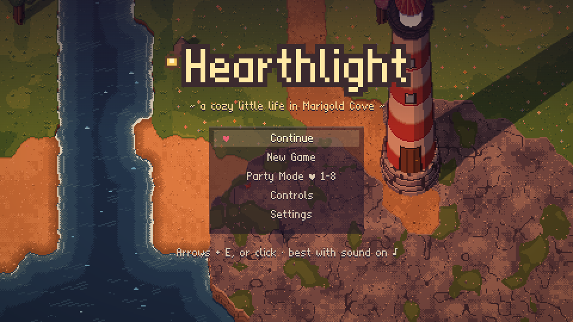

| | |
|---|---|
| 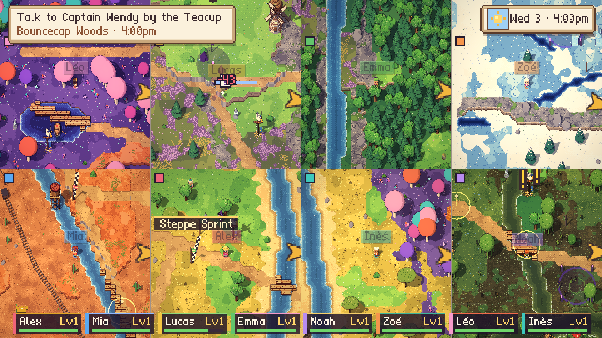 |  |
|  | 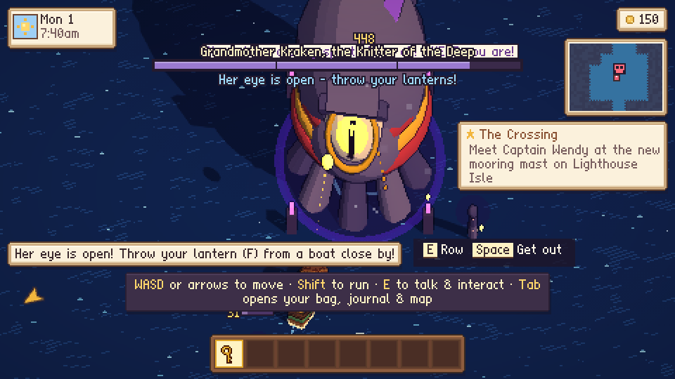 |

## Play

- **Browser version** — play now at **<https://hearthlight.github.io>**, nothing to install. A
  computer is best; the game plays on a phone too.
- **Downloads** — the desktop app for Mac, Windows and Linux is on the
  [latest release](https://github.com/Hearthlight/hearthlight.github.io/releases/latest) (Party
  Mode works offline there: phones join over your Wi-Fi). The apps aren't signed (that costs money
  every year), so the first time:
  - **Mac**: right-click (or Ctrl-click) *Hearthlight* in Applications → **Open** → **Open**. On
    recent macOS, if it still refuses: System Settings → Privacy & Security → **Open Anyway**.
  - **Windows**: when SmartScreen says « Windows protected your PC », click **More info** → **Run
    anyway** (in French: *Informations complémentaires* → *Exécuter quand même*).
  - **Linux**: make the `.AppImage` executable (`chmod +x Hearthlight-*.AppImage`) and run it.
- **Build it yourself** — follow the [local setup and build instructions](#run-it-yourself).
- **Android** — the whole game in one ~3 MB APK, Party Mode included: see
  [Play on Android](#play-on-android) (a single WebView around the same files, built with the
  Android SDK's own tools — no Gradle, no Android Studio, no npm).
- **Languages**: English, Français, Español, Deutsch, Italiano, 简体中文 — picked from your system,
  changed in Settings (the phones follow the big screen).

### Party Mode: 1–8 players on one screen

The game runs on the big screen (a TV, a laptop); everyone plays with what's in their hands:

- **Phones** — open Party Mode and scan the QR code (or type the address and the 4-letter code).
  Your phone becomes your controller *and* your own little screen: your hero, talents, gear, the
  map, the quest journal, the wardrobe. In the browser version phones join over the internet;
  with the **desktop app**, phones on the same Wi-Fi join it directly — no internet needed (allow
  incoming connections if your computer asks).
- **Gamepads** — Xbox, PlayStation, Nintendo, any browser-ready pad: press A to join, even halfway
  through the adventure. **Select** opens your own menu on the big screen.
- **The keyboard** — one player: ZQSD / WASD or the arrows, E or Enter to act (Tab: your menu).

Pick the Starfall Festival's mini-games, the Festival Ring's waves and brawls, or the whole
adventure together — the camera splits the screen when you wander apart.

| | |
|---|---|
|  | 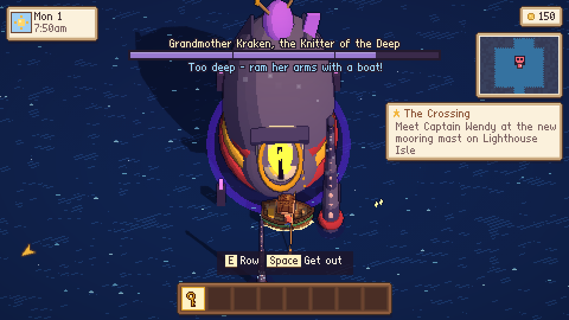 |
|  |  |

## Invite friends and resume an adventure

**Party Mode** opens the lobby straight away, with **one link for everyone** (its QR code is on
the big screen; to send it, open the menu — Esc or Start, or the crown on the host's phone — and
pick **Invite**, or tap the envelope on any phone). Whoever opens it picks where they play:

- **At the big screen** — their phone becomes their controller, and everyone watches the big
  screen (it splits when you wander apart).
- **On my own screen** — from home: the game streams to their screen with **a camera of their
  own** (no split for them), played with a keyboard, a gamepad or their phone. Arrows at the edge
  of each view say where the others are. The host keeps the game open; a slower, silent
  fallback takes over when a network blocks live video.

Keyboard and gamepad players have their own menu (hero, talents, gear, look): its key is shown
on their badge (Tab, Select…), and the host menu lists it too.

**Continue** goes straight back to your saved game (or asks which one, solo or party).
Settings → **Saves & backups** exports, imports or backs up a save online — keep the recovery
key private. See [online play and saves](docs/ONLINE.md) for controls, limitations and self-hosting.

## How it's made

- **Plain JavaScript, no build step** — ES modules straight in the browser (about 74 000 lines of
  game code in `src/`, plus 25 000 lines of translations), no framework, no bundler, no npm
  install to play.
- **Three.js 0.170** (in `vendor/`) draws the world at a low resolution with an oblique camera, toon
  lighting, depth outlines and a colour-grading pass; the pixels are scaled up crisp.
- **Everything is procedural** — terrain, buildings, characters (voxel chibis), trees, weapons,
  icons, the pixel font, the music (a small synth and data-driven tracks) and the sound effects are
  all generated in code at load time. A 1728×512-tile world streams in chunks painted in workers.
- **Party Mode**: the game runs on the big screen; phones join through a tiny WebSocket relay
  (`server/relay.mjs`, Node + `ws`) that passes controller messages — a controller-only party of eight is
  ~500 messages a second, 0.3 Mbit/s. The online relay allows up to 150 controller rooms. Remote video has separate bandwidth limits; this is not a promise of 150 streamed games.
- **The desktop app** (`desktop/`, Electron) has the relay built in: phones on the same Wi-Fi join
  directly, no internet needed. The same goes for the dev server (`tools/devserver.py`) and
  anything else hosting the game: **Settings · Party server** takes one address (the machine's own
  LAN address is filled in for you when it can be) and the party — the relay and the page the
  phones scan — runs from there.
- **Hosting**: the web version on GitHub Pages, the relay on a small VPS (nginx, systemd).
  The relay keeps anonymous counters — visits, parties, players, their country and language — and
  never writes an IP address into those counters (see `server/stats.mjs`). IP addresses are
  used briefly in memory for abuse prevention. Routine access logs omit IPs and URL parameters;
  server error and SSH security logs can contain IPs. See [Privacy](PRIVACY.md).
- **Six languages**, dictionaries keyed by the English text (`src/lang/`), each with its
  translation guide; Chinese has its own bitmap font, rasterised offline from Source Han Sans SC.
- **Tested by bots**: `tools/` has bots that join through the real relay and play the whole story,
  fake gamepads, balance runs, frame-time probes and screenshot tours.

## License

MIT — do what you like with it (play it, change it, share it, sell it), keep the copyright notice.
See [LICENSE](LICENSE). Three.js and qrcode-generator (in `vendor/`) are MIT too; the country
database used by the relay's counters is db-ip.com's IP to Country Lite (CC BY 4.0).

## Run it yourself

You can play from source or make your own desktop installer. GitHub Actions and the release
files are optional.

### Get the source

Install [Git](https://git-scm.com/downloads), then run:

```sh
git clone https://github.com/Hearthlight/hearthlight.github.io.git
cd hearthlight.github.io
```

Alternatively, choose **Code → Download ZIP** on GitHub, extract it, and open a terminal in the
extracted folder. While the repository is private, access to it is required for either method.

### Play in your browser

Install [Python 3](https://www.python.org/downloads/), then run from the repository folder:

```sh
python3 tools/devserver.py 8765
```

On Windows, use `py -3 tools/devserver.py 8765` in PowerShell. Open <http://localhost:8765> and
leave the terminal running; **Ctrl+C** stops the server. Open the URL instead of double-clicking
`index.html`: the game uses JavaScript modules. No npm install or compilation is needed;
Three.js and the other browser libraries are included in `vendor/`.

The server includes the Party relay. Phones on the same Wi-Fi join at the address shown in the
lobby. Add `--local` to the command to accept connections only from your own computer. This is
a development server for your machine or trusted local network; use the [Node relay guide](server/README.md)
for a hosted service.

### Run or build the desktop app

Install [Node.js 24 with npm](https://nodejs.org/en/download), then, from the repository folder:

```sh
cd desktop
npm ci
npm start
```

This opens the game with its local Party relay. To create an installer, close the app and run
**one command for your operating system**, from the same `desktop` folder:

| Build on | Command | File created in `desktop/dist/` |
| --- | --- | --- |
| macOS | `npm run dist:mac` | `Hearthlight-<version>-universal.dmg` (Intel + Apple silicon) |
| Windows | `npm run dist:win` | `Hearthlight-Setup-<version>.exe` (x64) |
| Linux | `npm run dist:linux` | `Hearthlight-<version>-<arch>.AppImage` (x86_64 on an x64 machine) |

The first install/build needs internet access to download the tools. The finished app runs
locally, including phones on the same Wi-Fi. These commands create unsigned files on your
machine and do not publish them.

See the **[step-by-step desktop build guide](desktop/README.md)** for prerequisites, testing
your package, updating your source copy and troubleshooting.

### Play on Android

The whole game also fits in one `android/Hearthlight.apk`, about 3 MB: a single WebView around
the same files the website serves, Party Mode included. It is built with the Android SDK's own
tools and a JDK, so there is **no Gradle, no Android Studio project and nothing to install from
npm**:

```powershell
powershell -ExecutionPolicy Bypass -File android/build.ps1 -JavaHome <the folder holding bin/java.exe>
```

Phones with the app join the hosted relay, so Party Mode works over any network: the lobby's QR
code opens the hosted controller page, and friends can play from their browser too. The
**[Android build guide](android/README.md)** lists what to install, every option the script takes,
and how to check a build when no phone is attached.

## The Grand Monde: a story in ten chapters (World v7)

The world has grown into two continents — **the Hearthlands** and, across the Wide Sea, **the
Dawnlands** — with relief everywhere (plateaus, cliffs, a volcano, hot springs, karst pillars,
a whale-sized island, a Great Tree), lands modelled on great national parks, and a story that
runs through all of them, in solo and in Party Mode (1–8 players) alike:

**Duchess Gloria Gloomsworth**, a failed opera diva booed off the Starfall Festival's stage thirty
years ago (a hen walked on during her aria), is stealing the world's Great Hearths from her
flying opera house, **the Gloomstage**, and the grey **Murk** rolls over every land she darkens.
You carry Nana June's lantern from hearth to hearth — levels 1 to 40, ten chapters, a dungeon
and a boss in each:

- **Scenes** (the camera, actors, title cards, a sepia flashback, full-screen letters), skippable
  by the host; the Duchess's herald Crumble and his ever-worse Snuffbots; the Understudies, three
  hopeless actors who audition at every turn and slowly become your friends; Captain Wendy's
  flying Teacup and the Pelican Post, always late.
- **Ten dungeons**, each with its own mechanic: the Glimmer Grotto (Old Glimmer's light and the
  old Lamplighters' mirrors), the Rootway (an outdoor instance), the Old Mine's rail points,
  singing ice bells, the Sunken Bell's tides, the Forge Heart's vents, the Lantern Pagoda's
  dawn beam, the Heartwood's firefly jars, Hollowmoor Manor's clocks (the rooms shift between THEN
  and NOW) and the Gloomstage's spotlights (sneak through the wings, the fly tower, the stage).
- **Bosses** that each ask something different — kick Barkbeard's golden acorns back into his
  beard, knock out Grumbleclaw's gloom lanterns, trap the Drillosaur in its own tunnel, lead a
  hen to the Duchess's Debut, catch Old Lucky the paper dragon in the dawn, lure the Moth Queen's
  swarm to a firefly jar, reach the Lady in Grey in the past — and the **Grand Finale** in three
  acts, won not by hitting her but by a letter thirty years late.
- **Mini-games woven into the quests** (stomping, relighting lamps before your lantern gutters,
  kites, nets, jars to carry, a rhythm act, leaf piles, ghosts only a lantern shows, rainbows to
  catch, a cannon to defend, a runaway cuckoo), **side quests** in every land, and five to play
  again and again: the Pelican Rush, the Minecart Rush, Lamplighting, the Ghost Hunt and the
  Talent Show.
- **World bosses** (Old Thunderhoof, the Paper Tiger, the Moonmoth, the Crystal Behemoth, the
  Aurora Wyrm — announced to the whole party, scaled for one hero or eight) and ten **rares**
  with silver name plates, each wearing a treasure hat that's yours when they fall (Sir Reginald,
  the Gloomiest Hen, drops a hen to wear).
- Monsters keep their land's level and grow with the heroes around them — a camp takes about as
  long to clear alone as with eight friends (a foe more for every two heroes, an elite for every
  three, shields that grow too), and bosses get tougher still; the phones show quests, the map
  and the Murk.

| | |
|---|---|
|  |  |
|  |  |
|  |  |
|  |  |
|  |  |


## Life in Marigold Cove

Arrive by ferry in a sleepy seaside village, make friends, farm, fish, forage, earn coins, grow and
decorate Nana's cottage, fund projects that change the town — and help the whole cove relight
**Old Glimmer**, the lighthouse that went dark. The valley around it: Honeydew Fields with its
windmill and big red barn, the Whisperwood camp and the Old Oak shrine, Waterfall Lake, the glowing
mushroom grove, Starfall Hill's telescope, Willow Lake, the lavender rows, Seagull Bluffs, the snowy
pines of Frostpine Ridge, the cherry trees and koi bridge of Blossom Glade, the Reedmarsh boardwalk,
the leaf piles of Maple Hollow — and Turtle Isle, a ferry ride away.

| | |
|---|---|
| 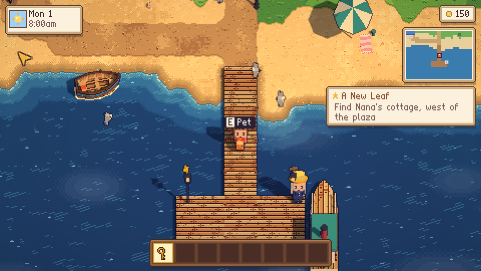 | 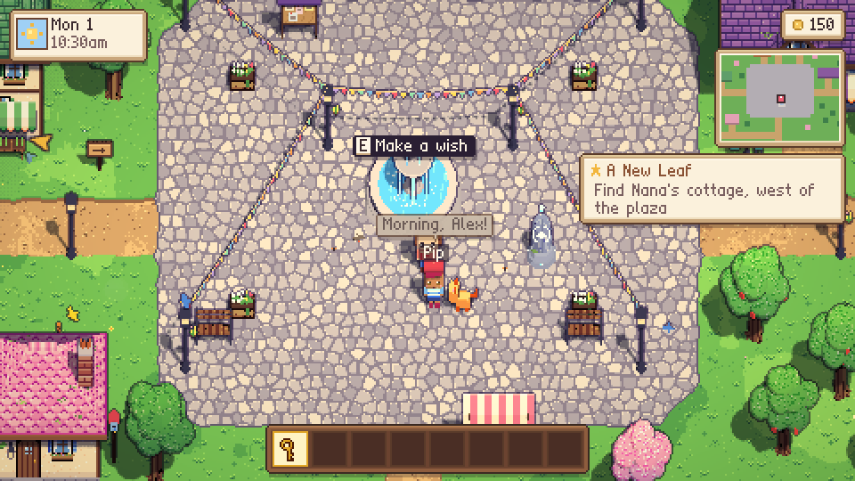 |
| 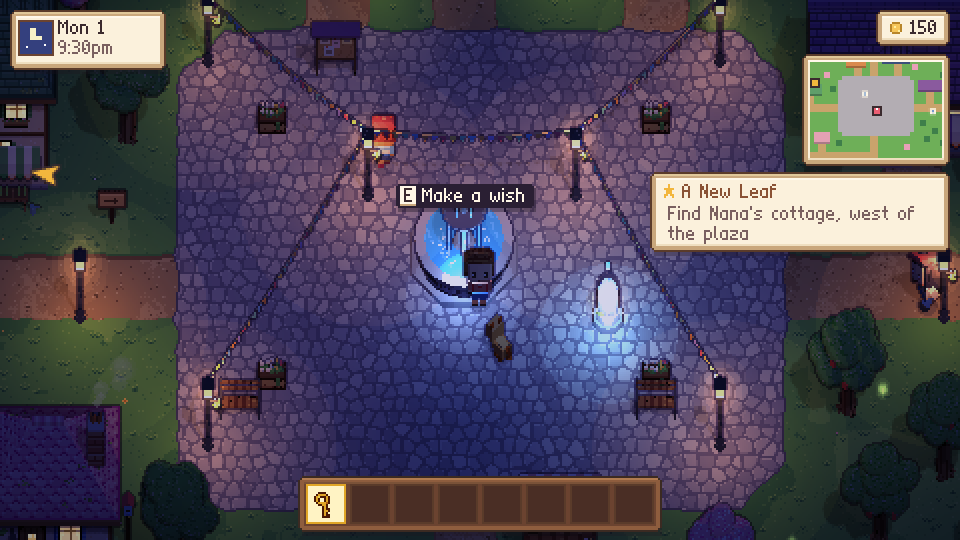 | 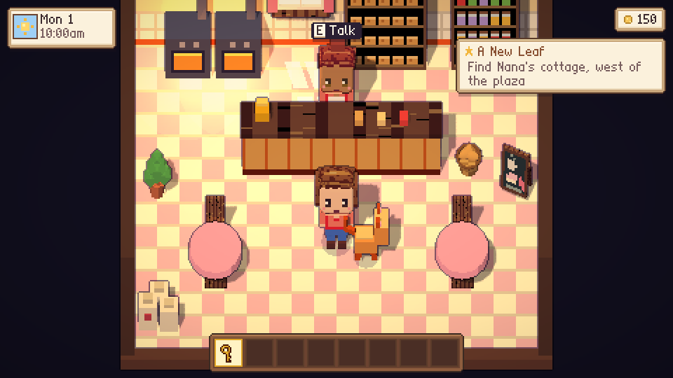 |
| 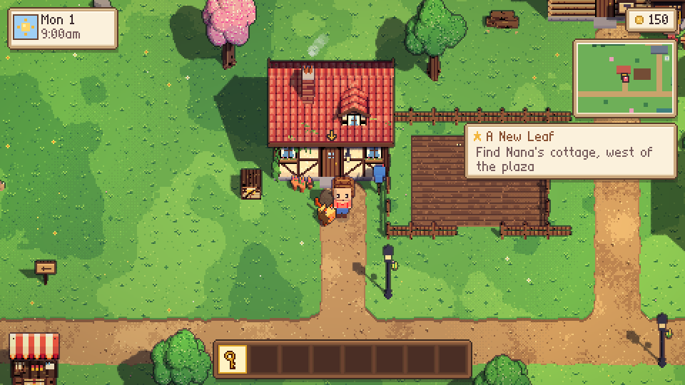 |  |
| 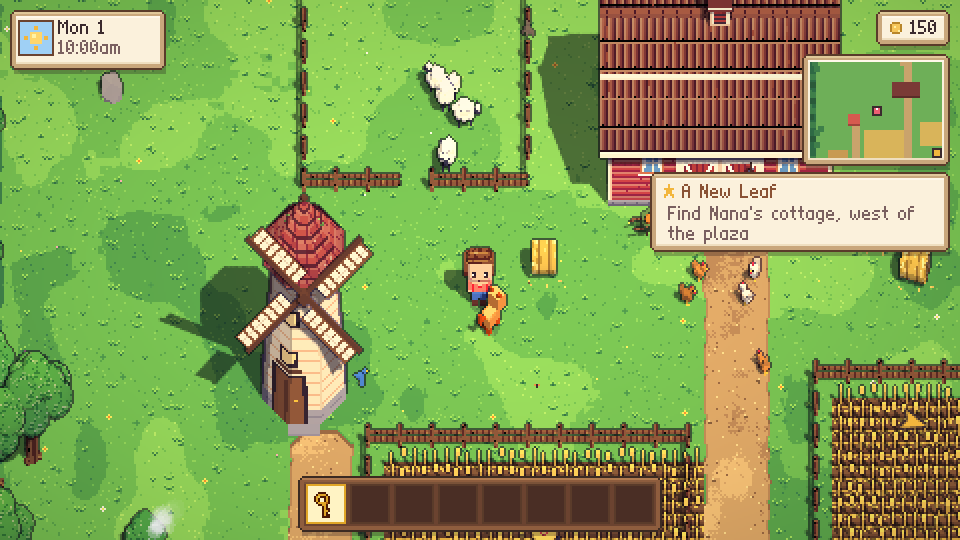 |  |
| 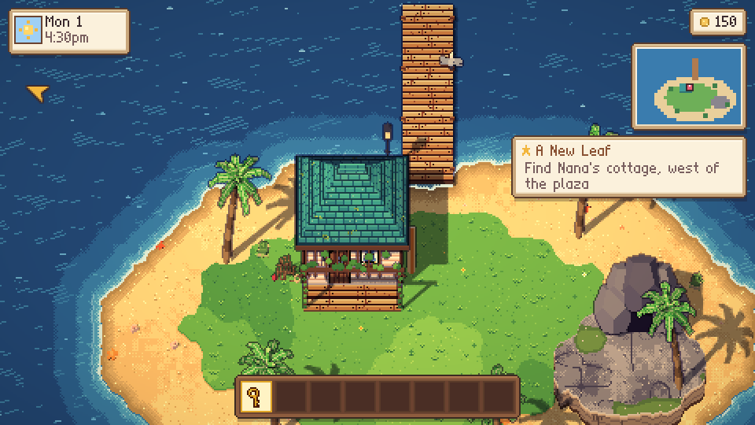 | 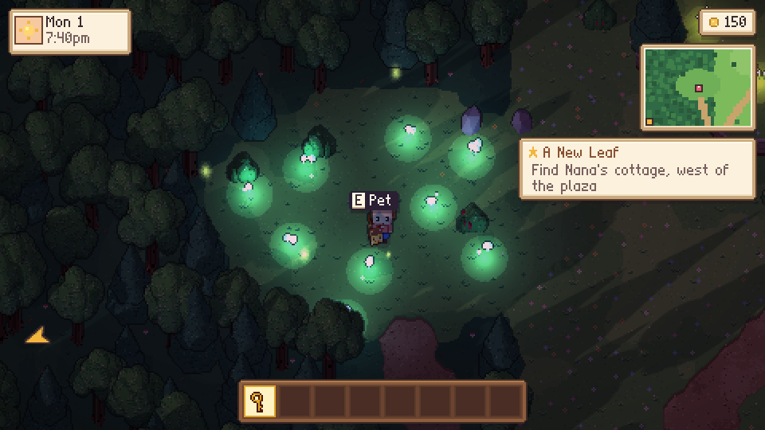 |
| 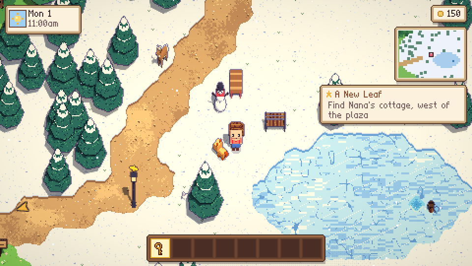 | 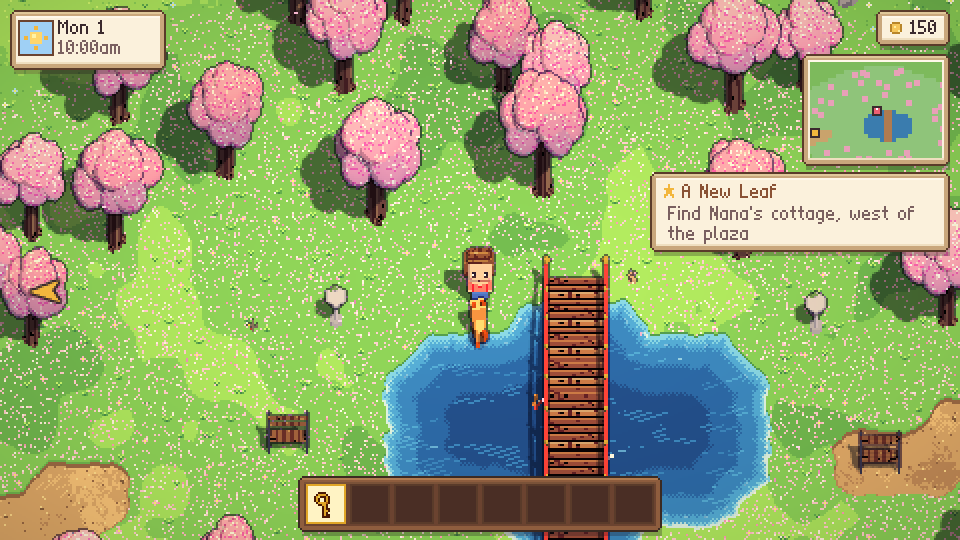 |
| 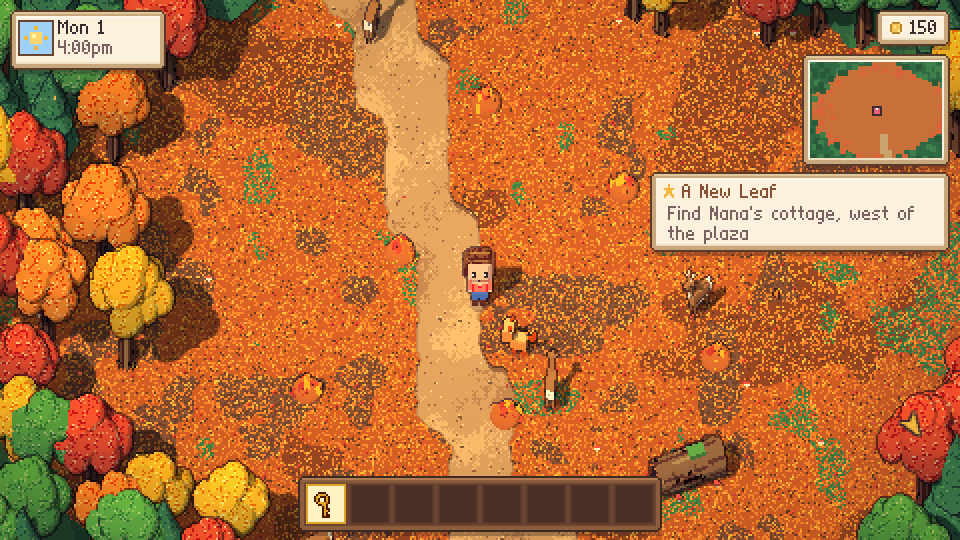 | 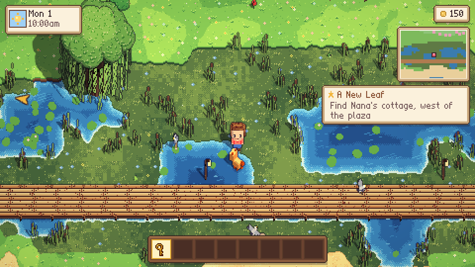 |
|  |  |
|  |  |

## The wild lands (solo)

The valley's roads now lead out of it: past the gates lies the whole world of Party Mode — Deep
Whisperwood, the Windy Heights, Bouncecap Woods, the Frostpeak Glacier, the Cloud Isles, the
Golden Steppe, the Red Canyon, the Sunscorch Dunes, the Sunken City, the Coral Lagoon, the
Whirlpool Straits, Croakmire, Emberpeak and Dino Isle — while the village life (story, friends,
farm, shops, home, festival) carries on as before at its heart.

- **Your hero.** Your first steps out of the valley ask how you'd like to face the gloom: a
  frying pan (*Knight*), a star wand (*Mage*), a slingshot (*Ranger*) or a lute (*Bard*). Out in
  the wild you carry it: combos, charged heavies, a special, dodge rolls and parries — and back
  home the tools come back. Gloom camps in every land, five guardians in their lairs, chests with
  weapons, runes and charms, XP and talent points. Knocked out, you take a nap and wake up at the
  nearest waystone. A health panel sits under the clock, a WoW-like **action bar** shows your
  moves' icons, cooldowns and keys; **Adventure difficulty** is in the settings.
- **The Hero page** (menu, or **H**): switch heroes, grow your three talent trees, wear your
  weapon and gear, choose which mount comes when you whistle and which companion follows you —
  with the keyboard, a gamepad, the mouse or a finger. Once a tree's capstone is learned,
  fighting fills an **ultimate** gauge: unleash it with **G**.
- **Getting around**: swim and dive for pearls and relics (from any shore), row and sail, glide,
  sled, ride the minecarts and the balloon up to the Cloud Isles; tame stags, boars, giant hens,
  turtles, bears, big frogs, triceratops and raptors with the food they love, then ride them — on
  land and in the water.
- **Out there**: waystones to travel between (the Market Plaza's is always on), four
  **wanderers** camping by them — Rook, Sigrid, Moss and Kai, with tips and a treat they wish
  for — and Pim trading mystery gear at the Nomad Camp (except on Sundays: market day). Sealed
  golden chests, buried treasure, races with records, gloom invasions at the waystones,
  migrations, shooting stars at night — and the **Festival Ring**: ring its gong to hold it
  against ten waves of gloom, the whole village cheering in the stands.
- **Doors that open**: the Nomad Camp's yurts, the igloos, the windmills, the Mother Cap, the
  stilt houses, the hot spring bathhouse, the old mine and the camps' tents — walk up into the
  door and you're inside, with a bed to sleep till morning (the game saves) and a chest with
  something new every day. By a campfire at night, you can sleep out under the stars too.
- **Play with your phone**: *Settings → Play with your phone* shows a QR code; your phone becomes
  the controller (stick, A / B / X / Y with live labels, bag · map · journal · hero, the hotbar,
  your health, taming, talents & gear). When running locally, phones use the same Wi-Fi and
  the relay included in the desktop app or `tools/devserver.py`.

| | |
|---|---|
|  |  |
|  |  |
|  |  |


## Party Mode (1–8 players, phones as controllers)

Put the game on a TV or projector, pick **Party Mode** on the title screen, and everyone joins
with their phone: scan the QR code (or open the address shown and type the 4-letter room code) —
or with a gamepad (press A) or the keyboard, and their own menu opens on the big screen (see
[Controls](#controls)).
With the browser version, phones join through the online relay. With the desktop app or
`tools/devserver.py`, phones must be on the same Wi-Fi as the computer. The dev server prints
the address phones should use (on macOS, allow Python through the firewall the first time).

| | |
|---|---|
|  |  |
|  |  |
|  |  |
| 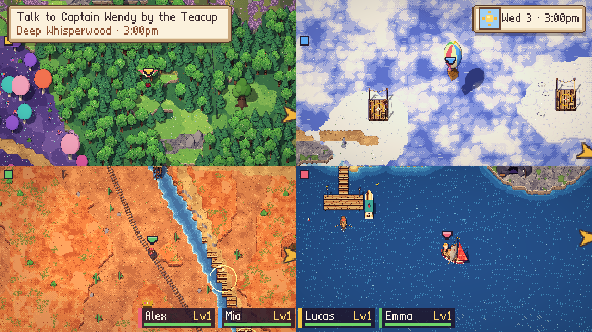 |  |
|  |  |
|  |  |
|  |  |


**The phones.** Every phone styles its own villager and picks a **hero**, then becomes a
thumb-stick with four buttons whose labels and **icons** follow what you're doing — A (talk,
open, ride… or attack), B (jump), X (your hero's special) and Y (dodge in a fight, whistle for
your mount otherwise) — a **U** button that fills up and glows when your ultimate is ready, plus
your health, level and a hint line; a Map button and, in the evening, a Campfire button. Its
menu is a grid of illustrated tiles: your **talent trees**, your **gear** and weapon, your mounts
and companions, your hero, the map, your look, a campfire (and, for the host, the crown's menu).
The **map** is drawn on the phone itself: pinch or double-tap to zoom, drag (and flick) to move
it, one tap to go back to you or to see the whole world with its legend; tap a waystone, a camp,
a lair or a friend to read what it is. No phone? Keyboard (E / Enter, G for the ultimate) and
gamepads can join on the big screen — where the world map zooms too (the wheel, a drag, + / −,
the host's zoom rocker).

**The host phone (♛).** The first phone wears a crown (it can be handed over, and moves on by
itself if that phone drops out). It **starts the party** from the lobby when it likes (a big
Start button shows who's ready). Its menu runs the party: pause, skip a line or a whole scene,
restart or switch activity, back to the lobby, difficulty, friendly fire, volumes, language,
players, **fast travel** to any waystone found, the world map — and the **camera zoom**, also on
a one-tap rocker right on the controller. The big screen has the same menu (Esc, or Start on a
gamepad).

**The camera** keeps pixels crisp at every zoom level; Auto picks the level from how spread out
everyone is. While the party fits on screen it shares one view; when groups drift apart the
screen splits along the line between them, and three or more groups get a grid of panels (a map
fills any spare one). Tree crowns thin out wherever they hide someone, so forests stay playable.

**A whole world.** The valley is now the heart of an 800 × 400-tile world streamed around the
cameras: Deep Whisperwood, the Windy Heights and their windmills, Bouncecap Woods, the Frostpeak
Glacier, the Cloud Isles, the Golden Steppe, the Red Canyon, the Sunscorch Dunes, the Sunken
City, the Coral Lagoon, the Whirlpool Straits, Croakmire and Emberpeak — each with its own
ground, landmarks, music, ambience, weather (gusts, blizzards, sandstorms, squalls) and quirks
(bouncy mushrooms, floaty clouds, lava embers, dust devils). The world map lifts its fog as you
go and keeps count of what you've done.

**Getting around.** Swim and dive for pearls; row (in rhythm, together) or sail; glide off the
heights, sled down the glacier, ride the canyon's minecarts, the cloud balloon and the ziplines.
Wild **mounts** roam their lands — stags, boars, giant hens, turtles, bears and big frogs: bring
their favourite food, win their trust in a little phone game, then ride them (each has its own
attack and trick: a dash, a charge, a flap, a shell spin, a ground slam, a mega leap). Touch the
**waystones** to travel between them by vote, or from the host's menu.

**Fighting**, cozy but crunchy (nobody dies — you take a nap until a friend helps you up): light
combos, charged heavies, air moves and a special per hero (*Knight*, *Mage*, *Ranger*, *Bard*);
**dodge** with Y (a perfectly timed one **parries** — shots fly back), fire / ice / poison / shock
statuses (freeze then shatter), juggles, a party combo meter and **finishers** on staggered foes.
Every hit is a show: slash arcs that sweep with the swing, shockwaves, cartoon explosions coloured
by their element, lightning that forks and chains, ice spikes, fire columns, pillars of light,
meteors with trails. Each hero has **three talent trees** in the spirit of WoW — Knight *Guardian
/ Tempest / Earthshaker*, Mage *Pyromancy / Frost / Arcana*, Ranger *Marksman / Demolition /
Scout*, Bard *Hearthsong / Symphony / Rhythm* — five rows of illustrated, ranked talents that open
as you spend points (shields, crits, execute-style finishers, chains, auras, cooldown refunds…),
crowned by an **ultimate** (Bulwark, Meteor Storm, Absolute Zero, Deadeye, Hymn of the Hearth…).
Heroes grow to level 30. **Weapons** come in four kinds per hero, each with its own moves (a
rolling pin's four-hit combo, a mallet that quakes, a bow, a returning boomerang, a crystal orb's
chaining sparks, a drum's beats…), from common to legendary, with traits and legendary effects;
**gear** adds a rune for your weapon's element and two charms, upgraded with stardust.
Seventeen new gloom creatures each ask something different of you (burrowers, kamikaze imps,
healers to interrupt, shield bearers, rolling beetles, sneaky ghosts…), with elites and
**gloom camps** in every land — and five **guardians** in their lairs (the Sand Queen, the Frost
Colossus, the Frog King, the Magma Golem, the Tyrant King), three phases each, every attack
telegraphed. They meet the party's level and size.

**What to play** (voted on the phones):

- **The Starfall Festival** — the co-op story: win back the five Star Charms of the Sky Lantern
  in mini-games hosted by the villagers (hen round-up, snowball scramble, acorn hunt, koi catch,
  star stones), then the lantern rises and everyone gets an award.
- **Explore & adventure** — cleanse the gloom nests of the valley until the Grumblecloud comes
  down for a boss fight; dig up treasure hats; free animals that become companions. Then the wild
  lands: gloom camps and guardians; **sealed golden chests** behind co-op plates (light all three
  at once — a sprint alone) or singing crystals (play the tune back); a buried treasure in every
  land; **races** on the roads with checkpoints and records; friends from the valley waiting by
  the waystones with tips, and Pim trading mystery gear for stardust. The world lives on its own:
  **gloom invasions** at a waystone (hold out through three waves), **migrations** of calm,
  easy-to-tame herds, and **shooting stars** at night (catch one for a wish for everyone).
- **The Festival Ring** — a stadium out on the steppe, with stands full of villagers:
  *gloom waves* (ten waves, a blessing card each round), *brawl* (friendly free-for-all) and
  *king of the ring* (hold the golden circle). Ring the gong while exploring to fight there.

**Nights.** The clock sits in the corner of the big screen. In the evening anyone can light a
**campfire** (a button on the phone): it lights the dark, warms and heals, and friends sit around
it. At night, A by the fire lets you sleep; once everyone sleeps by a fire or in a bed, the night
flies by and the party wakes up, rested, to a new morning — unless the gloom comes knocking.

**Indoors.** Every house and shop of the valley — and the wild lands' yurts, igloos, windmills,
stilt houses, bathhouse, mine and tents — opens its door: walk up into it and you're inside, in a
view of your own if the others stay out (lit like an interior while theirs shows the night).
Shopkeepers wait at their counters for a chat (Rosa, Ivy, Sol, Mabel, Theo, Finn…), you get your
breath back, a chest has something for each of you every day, and at night a bed is as good as
a campfire. Walk down onto the doormat to go back out.

Eight players in four split views run at about 8–10 ms a frame.

## Dino Isle, new gloom & companions (Adventure v5)

Far to the south-east, a long causeway runs from Emberpeak across the sea to **Dino Isle**: tree
ferns, cycads and giant leaves, a river, bubbling tar pits, Fernpeak's mossy rock, a dig site
under a long-neck's skeleton and the Dino Station (walk in: maps, a radio, a hammock) — with its
own jungle music, tropical showers, morning mist and fireflies. In solo and in Party Mode alike:

- **Gentle giants**: long-necks with their babies (walk right under a belly), stegosaurs at the
  jungle's edge, pteranodons wheeling overhead. Press A by one to give it a pat.
- **Dinosaurs to ride**: a triceratops (bring it a fern frond; its *Stampede* is a thundering
  charge) and a raptor (a fresh fish; *Pounce* leaps at the nearest gloom).
- **Gloomy dinosaurs** guard the island's camps: raptor packs that circle and pounce, a
  venom-spitting dilophosaurus, diving pteranodons, a club-spinning ankylosaurus, compsognathus
  swarms and a charging triceratops. Freed, they run off in their own colours — a freed
  triceratops even lets you ride it.
- **The Tyrant King**, the island's guardian, sleeps by his nest: a crowned T-rex with three
  phases — chomps, tail sweeps (jump!), lane charges that leave him dizzy if he rams a rock, a
  bellow that calls his raptor pack and a quake that brings rocks down on everyone. Freed, he
  stomps home and dozes in his nest, where you can pat him.
- **New gloom elsewhere**: gloom jellyfish rise from the warm seas when you walk their shores,
  bat swarms join the woods', the canyon's and the bog's camps at night, and now and then a
  camp's reward chest turns out to be a **mimic**.
- **Companions**: a gloomy animal you free may become your friend for good — a fox, a fawn, a
  crab, a young raptor, a compy. Choose who trots along with you (or send them home) from the
  phone's **My companions** menu, in Party Mode and in solo, or on the solo Hero page; your
  companion comes back after every activity, nips at the gloom and sits by your side when you
  stop.

| | |
|---|---|
|  |  |
|  |  |


## Languages

English, French, Spanish, German, Italian and Simplified Chinese, picked automatically from the
browser (change it in the settings, or on the crowned phone in Party Mode). The phones follow the
big screen's language. Solo lines speak to *you* (tu · tú · du · tu · 你); in Party Mode the story
speaks to the whole group (vous · ustedes · ihr · voi · 你们). Chinese is drawn with its own bitmap
face, rasterised offline from Source Han Sans SC (`python tools/gen-cjkfont.py`). Each language has
its translation guide (`tools/i18n-glossary*.md`); `node tools/i18n-scan.mjs` checks that nothing is
missing in any of them.


## Controls

Play with the keyboard, a gamepad or your phone — whichever is in your hands: the game follows
the last one you touched, and every prompt names its buttons (a key, an Xbox pad's A B X Y, a
PlayStation pad's ✕ ○ □ △, a Nintendo pad's B A Y X). **Controls** on the title screen (and in
Settings) shows all three side by side, tests a gamepad's rumble and shows the phone's code.

| Action | Keys | Gamepad |
|---|---|---|
| Move / run | WASD or arrows · hold Shift | left stick (push it far to run) or D-pad · RT |
| Jump · back | Space · Esc | B |
| Talk, use, interact — out in the wild: attack (hold it for a big one) | E / Enter (or click) | A |
| Special · Dodge (whistle for your mount, get off) | F · C | X · Y |
| Ultimate (once its gauge is full) | G | R3 |
| Hotbar | 1–8, mouse wheel, Q / R | LB / RB |
| Hop on / off the bicycle | B (once Bram gives you one) | L3 |
| Pause (resume, save, settings, controls, back to title) | Esc | Start |
| Bag · Journal · Map · Hero page | Tab / I · J · M · H | Select (then LB / RB) |
| HUD: full · compact · minimal | V (or click the map) | LT |
| Skip a scene | hold Esc | hold B |
| Pick up placed furniture | Right-click (at home) | X (at home) |
| Stuck somewhere? | Settings → Get unstuck | the same |

With a gamepad, your name is typed on an on-screen keyboard (X picks one out of the hat), the
stick walks any way you point it, and hits rumble (Settings → Gamepad rumble). On touch screens,
drag on the left to walk (further to run) and use the buttons on the right (Special and Dodge
appear out in the wild). A phone can be the controller too: Settings → Play with your phone.

In **Party Mode**, a gamepad (or the keyboard: ZQSD / WASD or the arrows, E or Enter) is a player
of its own: press A to join — in the lobby or halfway through the adventure — and **Select** (Tab
on the keyboard) opens *your* menu on the big screen: your hero, talents, gear, mounts, companions and
your name, spelled on the screen's letters. It slides in on the right while the others play on
(the camera moves the heroes over); a friend who asks meanwhile is next. Each pad rumbles on its
own hits.

| | |
|---|---|
|  |  |

## What's inside

- **2.5D pixel rendering** — Three.js renders the world at low resolution with an oblique 3/4 camera
  (ground and walls both map one texel to one pixel), toon lighting, depth-based pixel outlines and a
  painterly colour grade. Real sun shadows move through the day; lamps and windows glow at night.
- **Character creator & wardrobe** — chunky rounded voxel-chibi heads (kept camera-facing so they
  read as soft cubes from every angle, with a profile eye when walking sideways), skin tones,
  hairstyles, hair and eye colours, tops, bottoms, hats, accessories, facial hair and a pet
  companion (cat, dog or bunny). New outfits can be bought.
- **A big valley** — a 240×128-tile world with 23 named places and distinct biomes (coast, meadows,
  forest, farmland, snowy ridge, cherry glade, marsh, autumn hollow), a map with exploration fog, a
  ferry with a captain (and the odd dolphin), a bicycle, a hand lantern for dark places, a sea
  grotto, stargazing and campfires. Hop around with Space: slide across the frozen pond, leave
  footprints in the snow, cannonball into leaf piles.
- **Wildlife** — 18 species living by biome and time of day: deer, foxes and arctic foxes, rabbits
  and hares, squirrels, hedgehogs, frogs, songbirds, herons, owls at night, koi, turtles, crabs,
  gulls, ducks, hens and Bram's sheep. Shy ones bolt, curious ones sniff around you, birds take off.
  Every sighting goes into the critter log — spot enough for Juniper's Wildlife Watch.
- **Villagers** — twelve neighbours with daily schedules, portraits, friendship hearts, gift tastes,
  dialogue that changes with time, weather and friendship, ambient chatter, their own quests, and
  personal letters with gifts at 3 and 6 hearts.
- **Story** — a full arc of quests with cutscenes, from arrival to the Festival of Lights finale,
  plus side stories: the stuck windmill, the Whisperwood survey, Juniper's Wildlife Watch, letters
  washed up by the tide.
- **Economy** — shops, a farm stand, Pim's wandering market every Sunday (a new cart each week), a
  shipping crate and daily requests; spend it on furniture,
  clothes, tools, home expansions (Theo builds overnight) and town projects funded at the notice
  board — flower beds, road lanterns, a playground, a beach bonfire and a bandstand.
- **Life sim** — farming (seven crops), fishing (sea, river, ponds & lakes, ice fishing, the koi
  pond and the marsh, day & night fish, a calm reeling minigame), foraging, berry bushes, eggs & milk
  from the barn, fireflies, furniture, wallpapers and floors.
- **Day / night & weather** — a living clock, golden hours, rain, drifting cloud shadows, fireflies,
  falling snow on the ridge, cherry petals and autumn leaves on the wind.
- **Audio** — a synthesised soundtrack (title, day, evening, night, rain, interiors, shops,
  festival), ambience layers, dialogue blips and dozens of sound effects.
- **Saves** — autosave when you sleep, plus manual save in the settings.

## Project layout

```
src/
  engine/   display, input, bitmap font, colour & audio engine
  render/   Three.js renderer, lighting, portraits
  art/      procedural painters (terrain, surfaces, icons, palette)
  models/   buildings, nature, props, furniture, characters & pets
  world/    map layout, interiors, collision & pathfinding (big/: the Party Mode world —
            generation, workers, chunk streaming, collision, world map)
  scenes/   the main gameplay scene
  solo/     the solo game's wild lands (a "party of one" running Party Mode's systems), the
            Hero page, the wanderers, the phone as the solo controller
  systems/  farming, fishing, foraging, critters, town projects, effects
  story/    quests, dialogue lines & story scripts
  ui/       HUD, dialogue box, menus, shops, creator
  party/    Party Mode: phone relay client, inputs, host menu, split-screen camera & zoom,
            story & mini-games, exploration, the Festival Ring, zones & weather, swimming,
            vehicles, mounts, gloom camps, lairs, talents & gear, waystones, secrets, races,
            world events, buddies
  combat/   heroes, gloom creatures, blessings and the fighting itself (v3/: statuses,
            bestiary, bosses, talents, gear)
  lang/     translations (French, Spanish, German, Italian & Chinese), used through src/i18n.js
  pad/      the phone controller page (pad.html)
tools/      dev server (static files, screenshots, party relay), map dump, party test bots,
            translation scanner & glossary
android/    the Android app: a WebView shell, its icon and a build script that needs no Gradle
```
